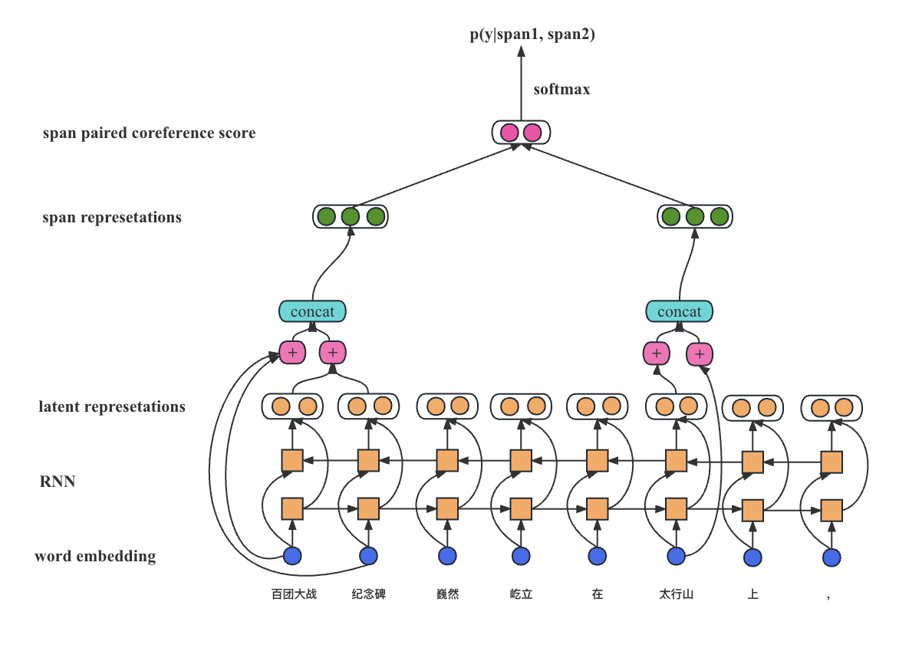

# Coreference Resolution 指代消解任务

此代码使用二分类来完成指代消解任务，模型结构大致如下：


## 安装

在使用之前，请确保你已经安装了以下依赖：

```
    torch 1.9.0
    random
    tqdm 4.65.0
    logging 0.5.1.2
    numpy 1.21.5
    networkx 2.6.3
    os
    argparse 1.1
    attr 21.4.0
    bz2file
    pickle
    datasets 2.12.0
    boltons
    collections
    itertools
    scipy 1.7.3
```

## 使用

此项目包含以下配置，可在 `run.sh` 自行设定
```
    sample_size: 每一个epoch训练的文档数量
    lr： 学习率
    epochs：训练轮数
    eval_epoch：在验证集上每隔多少轮评价
    log_path：训练日志路径
    attention：是否使用attention机制，1:使用，0:不使用
    model：模型，可选['lstm', 'rnn']
    pretrained_vector_path: 预训练词向量路径，为bz压缩文件
```

预训练词向量可在 https://github.com/Embedding/Chinese-Word-Vectors 中下载

你可以根据自己的需要更改 `run.sh` 中的配置，之后使用bash运行：

```
bash run.sh
```